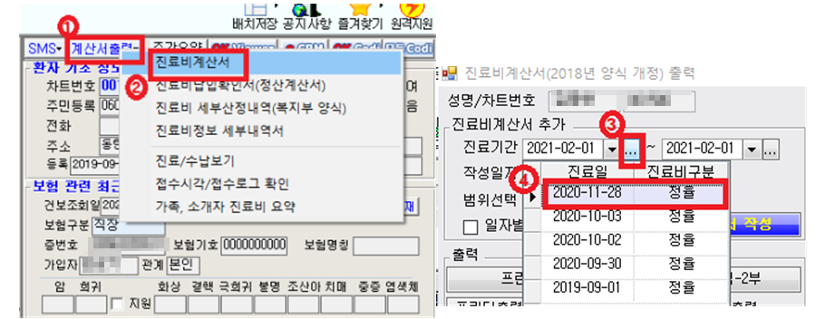
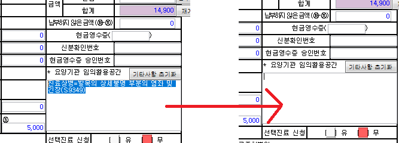
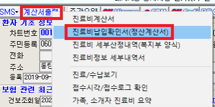
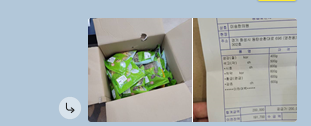
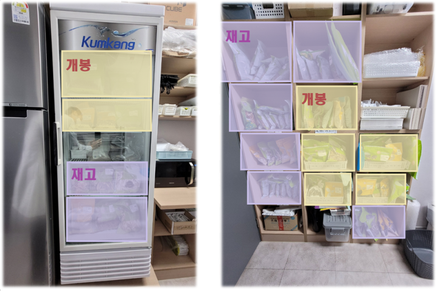

# 원무 · 정산 · 재고 매뉴얼

[매뉴얼 첫 장](./README.md) · [데스크](./desk.md) · [치료실](./treatment-room.md) · [한약·탕전](./herbal.md)

---

## 목차

- [진료비 영수증 발급](#진료비-영수증-발급)
- [현금영수증](#현금영수증)
- [마감 정산](#마감-정산)
- [물품 수령](#물품-수령)
- [재고관리](#재고관리)
- [비급여 가격](#비급여-가격)
- [약침 수납 가이드](#약침-수납-가이드)

---

## 진료비 영수증 발급

### 당일 치료에 대한 영수증 발급

원장실 차팅이 끝나고, 접수실 프로그램에서 수납까지 완료한 후 영수증을 출력합니다.

이름 검색 후 선택 → ① 우측 상단에 '계산서 출력' → ② '진료비계산서' → ③ '...' 선택 후
→ ④ 해당 날짜 선택

(진료비 계산서 = 영수증)

→ '요양기관 임의활용공간' 삭제

→ '저장' → '프린터출력'

### 여러 날짜에 대한 영수증 발급

'진료비계산서'와 '진료비납입확인서'를 같이 출력해드립니다.

- '진료비계산서'에는 총금액이 나와 있습니다.
- '진료비납입확인서'에는 날짜별 금액이 나와 있습니다.

'진료비계산서'는 당일 치료에 대한 영수증 발급하듯이 똑같이 진행합니다.
날짜 선택만 기간으로 선택해서 출력합니다.

'진료비납입확인서'는 우측 상단에서 선택 → 시작과 끝 날짜 선택 → '저장' → '프린터출력'

※ 모든 영수증에는 '한의원 도장' 찍고, 봉투에 넣어서 드립니다.
※ 모든 영수증은 무료 발급입니다.
※ 진단서, 진료확인서는 원장실에서 작성하여 원장이 직접 출력합니다.

### 진료비 세부내역서

- 세부내역서는 발행 전에 원장에게 미리 알려줍니다.
- 원장이 검토 후 발급해드리도록 다시 오더를 줍니다.
- 원장이 바빠서 소통이 불가능한 경우, 발급해드리고 내용 공유합니다. (선조치 후보고)

### 서류 비용

- 진단서 2만원
- 소견서 1만원
- 진료확인서 1천원
- 초진기록지 1천원

※ 원본 매뉴얼 안에서 진료확인서 금액이 두 군데에 다르게 적혀 있습니다.
영수증 발급 항목에는 3천원, 비급여 가격표에는 1천원입니다.
위에는 가격표 쪽 금액을 적어두었으니 어느 쪽이 맞는지 확인해서 확정해주세요.

---

## 현금영수증

현금영수증은 단말기로만 발행합니다.
차트 프로그램에서 중복 발급되지 않도록, 컴퓨터에서는 '아니오'를 선택합니다.

- 환자분이 원할 시 : 환자분 번호로 발행
- 원하지 않을 시 : 단말기에서 010 0000 1234 누르고 금액 입력

---

## 마감 정산

### 본인부담금 장부 (엑셀)

- 실제로 들어온 금액을 입력합니다.
- 인쇄 후 카드 정산 용지 출력된 것을 위로 해서 묶습니다.

### 카드기 정산

- 카드정산용지 출력 순서 : 집계 → 2 → 1 → 입력
- 엑셀의 카드 총금액과 일치하는지 확인합니다.

### 시재 정산

- 10만원으로 맞춥니다.
- 나머지 금액은 마감 결재 시 원장에게 전달합니다.

### 영수증

카드영수증 위에 현금영수증을 놓고 묶어서 보관합니다.

---

## 물품 수령

한의원으로 택배가 오면 수령한 사람이 '물품수령방'에 택배 내용을 공유합니다.

수령한 사람이 '택배 사진' + '물품명'을 올려주세요.

- 택배사진 : 오픈해서 물품 나오게 찍기
- 물품명 : 영수증에서 물품 리스트 부분만 찍어서 올려도 되고, 직접 타이핑해서 올려주셔도 됩니다.

물품의 종류나 개수가 영수증 내용과 맞는지 확인 후, 영수증은 원장실로 전해주세요.

---

## 재고관리

### 치료실, 탕전실 공통

- 재고확인 빈도 : 주 1회. (주 초반, 월~수 중)
- 재고확인 후 확인한 사람 이름 서명
- 기준 : 개봉하지 않고 남은 새것의 개수를 기입
- 작성은 작성대로 하고, 시켜야 할 물품과 수량은 원장에게 따로 보고. (포스트잇에 적어주세요)

### 약재, 탕전용품

- 담당 : 데스크 직원이 한 주씩 번갈아 가면서 '재고관리표' 작성
- 단위 : 약재는 봉지 단위. 탕전용품은 물품마다 따로 체크

### 치료실 물품

- 담당 : 치료실 직원이 한 주씩 번갈아 가면서 '재고관리표' 작성
- 물품마다 단위까지 함께 기록

### 재고관리표

※ 재고관리표 위치(파일 또는 인쇄물)와 품목 목록을 여기에 적어주세요.

---

## 비급여 가격

※ 금액은 이 표에서만 관리합니다. 바뀌면 여기를 고치고
[개정 이력](./README.md#개정-이력)에 한 줄 남깁니다.
한약·다이어트 금액은 [한약 비용표](./herbal.md#한약-비용표)에 있습니다.

### 처방 한약

| 품목 | 구성 | 금액 |
| --- | --- | --- |
| 사향원방 | 사향 0.06 | 확인 필요 |
| 치료한약 | | 확인 필요 |
| 녹용한약 | 사향 0.04 | 확인 필요 |
| 총명공진단 | | 확인 필요 |
| 원방경옥고 | | 확인 필요 |
| 녹용경옥고 | | 확인 필요 |
| 감비탕 | 20일 | 24만원 |
| 감비환 | 1달 | 14만원 |

※ 원본 가격표에서 위 여섯 품목은 금액이 비어 있었습니다. 확인해서 채워주세요.

### 상비 · 소포장

| 품목 | 구성 | 금액 |
| --- | --- | --- |
| 소아젤리 (입맛, 면역, 성장) | 20포 | 6만원 |
| 목향 | | 2만원 |
| 쌍화탕 | 1박스(15포) | 7만원 |
| 쌍패탕 | 2포 | 1만원 |
| 상비한약 A | 2포 | 1만원 |
| 상비한약 B | 2포 | 7천원 |
| 향성파적환 | 1set(30개) | 12만원 |
| 숙취해소제 | 1포 | 2천원 |
| 한방 파스 | 1팩 | 7천원 |
| 자운고 | | 1만원 |
| 변비환 | 3포 | 4,500원 |

상비한약 : 은교산, 맥문동탕, 위령탕, 쌍패탕 / 작감탕, 계지가갈근탕 / 반하산급탕

---

## 약침 수납 가이드

※ 원본 매뉴얼에 목차만 있고 내용이 비어 있던 항목입니다.
약침 종류별 수납 방법과 주의사항을 여기에 적어주세요.

진료비 금액은 [데스크 매뉴얼 · 수납](./desk.md#수납)에 있습니다.
