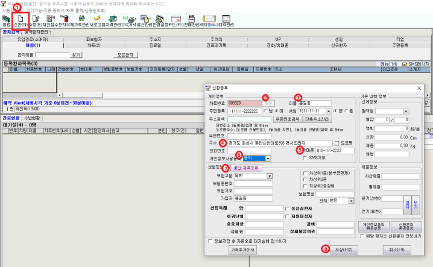
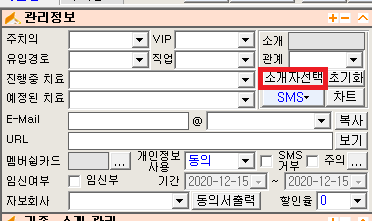
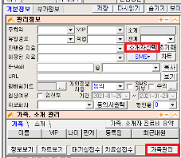
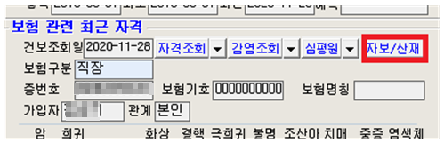
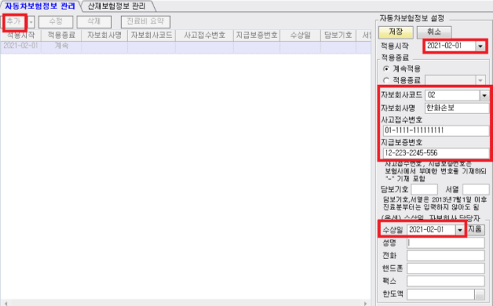
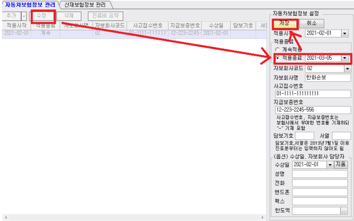
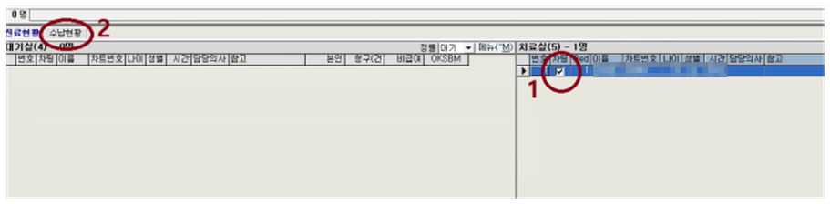
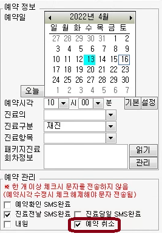
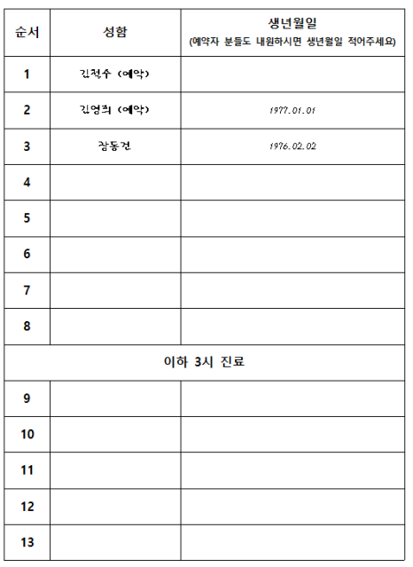

# 데스크 매뉴얼

[매뉴얼 첫 장](./README.md) · [치료실](./treatment-room.md) · [한약·탕전](./herbal.md) · [원무·정산](./admin.md)

---

## 목차

- [Keyword : 관심](#keyword--관심)
- [출근](#출근)
- [초진 접수](#초진-접수)
- [재진 접수](#재진-접수)
- [자동차 보험](#자동차-보험)
- [다이어트 환자](#다이어트-환자)
- [검사실](#검사실)
- [치료가 끝나고 나온 후](#치료가-끝나고-나온-후)
- [수납](#수납)
- [예약관련 추가](#예약관련-추가)
- [웰컴 경옥고](#웰컴-경옥고)
- [소개환자 관리](#소개환자-관리)
- [네이버 영수증 리뷰](#네이버-영수증-리뷰)
- [항의 응대](#항의-응대)
- [하지 않는 일](#하지-않는-일)

---

## Keyword : 관심

데스크 선생님은 환자에게 항상 관심을 갖고 있어야 합니다.

환자가 한의원에 들어왔을 때 기다리고 있다가 자리에서 일어나 반갑게 맞아 주는 것을 시작으로,
환자를 기억하고 성향을 파악하고 '내가 너에게 관심이 있다'는 것을 표현해주세요.
지난 차트 기록에서 아픈 부위나 다친 스토리도 읽어보고, 내원 횟수나 빈도도 파악하려고 노력해주세요.

환자는 한의원에 들어오면서 당연히 데스크에 사람이 있을 거라고 생각하고 있습니다.
데스크를 지켜주는 것은 환자와의 약속을 지키는 것입니다.
탕전 하러 갈 때, 검사실 갈 때 등 데스크를 비울 일이 있으면 미리 커버를 요청해주세요.

데스크에서 이루어지는 환자와의 소통 내용(대면, 전화 등)은 메신저를 통해 모든 스텝과 공유해주세요.

---

## 출근

### 스위치 ON

- 모든 등 켜기 (예외. 탕전실과 검사실은 위 스위치만 켬)
- 에어컨, 히터, TV
- 원장실 컴퓨터, 데스크 컴퓨터
- 인바디, 혈압계

### 데스크 컴퓨터에서 해놓을 작업

- 차트 프로그램 켜기 (본인 이름으로 로그인)
- 바탕화면에 '주차' 창 켜놓기
- 음악 켜기
- 메신저 켜기

※ 로그인 정보는 이 문서에 적지 않습니다. 보관 위치만 적어두고, 바뀌면 그곳만 고칩니다.

TIP) 바탕화면 오른쪽 위, 번호 순서대로 켠다고 기억하시면 됩니다.
① 네이버예약 ② 유튜브 ③ 주차권 ④ 하모니주차권

### 예약현황 체크

바탕화면에 '네이버예약' 더블클릭 → 이름, 이용 일시 확인 →
한의원 접수실 프로그램 '예약플래너'에 추가 → 네이버예약에서 확정

**상황 1) '예약플래너'를 보니, 이미 예약이 꽉 차 있는 경우?**

전화번호로 연락드려서 다른 시간으로 유도하기.

멘트 "안녕하세요. 김포한강한의원입니다. 예약 신청하신 거 보고 전화 드립니다.
어떤 불편감으로 내원하시려고 하시는지 여쭤봐도 될까요?
(환자대답 예. 허리가 아프다) 아~ 허리가 아프시군요.
첫 진료 시에는 상담 때문에 시간이 좀 걸리는데, 신청하신 시간에 예약환자가 많아서
대기시간이 좀 발생할 수 있습니다.
한 시간 뒤로 예약하시면 좀 더 진료받기 편하실 것 같은데 혹시 괜찮으실까요?"

**상황 1-1) 예약 시간 바꾸도록 유도하는 거에 대해 환자가 불만을 갖는다면?**

원하는 대로 해드리고, 메모 잘 해서 상황 공유하기.

### 일일장부 엑셀 파일 켜기

1. 바탕화면 '일일수납장부' 엑셀 파일 → 우클릭 → '복사' 클릭
2. 바탕화면 '일일수납장부' 폴더 → 더블클릭해서 들어가기
3. 년, 월 폴더 → 더블클릭
4. 빈 공간에 우클릭 → 붙여넣기
5. '일일수납장부' 복사된 파일 → 우클릭 → 이름바꾸기 클릭
6. '년, 월, 일'을 당일 날짜로 바꾸고 엔터
7. 방금 이름 바꾼 파일 더블클릭

### 그 외

- 예약환자 차트 꺼내놓기
- 먼지 쌓이기 쉬운 곳 닦기. 아침뿐만 아니고 하루 중에서 시간 나면 수시로 먼지 없도록 신경써주세요.
  손이 많이 닿는 곳은 소독액 뿌리고 닦기. 가까이서 뿌리고 닦는 식으로 수시로 소독합니다.
  (접수대, 소파, 자동문 버튼, 테이블, 정수기 주변 등)
  ※ 소독액은 공기 중에 분무하지 않도록 합니다. 흡입되면 인체에 해롭습니다.
- 원장실 수건 2장 교체, 텀블러 세척
- 원장실 '차트장'이라고 써져있는 파일꽂이에 있는 차트 수거 (하루 중에도 수시로)
- 정수기 옆 티백 채워놓기
- 다이어트 복용법(탕비실), 각종 차트(데스크), 인바디 용지(검사실) 부족하지 않게 복사해놓기

---

## 초진 접수

증상에 맞는 종이차트를 작성하신 뒤, 종이차트를 수거하여 차트에 등록합니다.

초진 종이차트(문진표) 종류

- 기본 : 종이차트
- 다이어트 : 다이어트 문진표
- 약상담 시 : 예비 문진표

### 신환등록

① 신환 ② 차트번호 '추천' ③ 이름 입력 ④ 주소 입력 ⑤ 휴대폰번호 입력
⑥ '동의'로 선택 후 마지막에 서명받기 ⑦ 공단자격조회, 인증서 비밀번호 입력 ⑧ 저장

### 소개자, 가족 등록

종이차트에 소개로 내원했다고 체크되어 있을 경우,
부담 주지 않는 선에서 가볍게 소개자분 성함을 여쭤봅니다.

멘트 (지인소개 체크한 걸 가리키면서) "저희 한의원 소개 받고 오셨어요? 혹시 소개자분 성함이...?"

- 가족이라면 '가족관리'에서 가족구성원으로 추가
- 그냥 지인이라면 '소개자선택'에서 소개자분 이름 추가

이후 응대는 [소개환자 관리](#소개환자-관리)를 봐주세요.

### 환자유형

- 초진 : 처음 온 환자
- 재진
- 재초진 : 초진비 13,900원 수납. 90일 이상 지나서 내원했을 때가 기준입니다.

ㅊ + F3 : 현주증상 체크

---

## 재진 접수

### 기본적인 경우

- 성함 여쭤보기. 동명이인일 경우 생년월일로 재확인
- 환자분 치료실로 안내

### 다이어트 환자의 경우

- 성함 여쭤보기. 동명이인일 경우 생년월일로 재확인
- 차트번호로 종이차트 찾기
- 검사실로 함께 이동하여 인바디 측정
- 인바디 결과지 인쇄되면 종이차트에 끼워놓기
- 차트와 함께 진료실로 안내

---

## 자동차 보험

### 접수

환자에게 보험사와 사고접수번호를 적어달라고 요청합니다.

→ 해당 보험사 콜센터로 전화해서 사고접수번호 말해주고 '지불보증서' 요청하여 한의원 팩스로 받기
→ 접수실 프로그램에서 자보 등록

→ '추가' → 빨간 네모칸에 있는 내용은 필수적으로 입력 → 기타 부분은 입력하면 좋음

- 사고날짜
- 보상담당자 이름
- 보상담당자 전화번호

구글 스프레드시트에 수상일 넣으면 자보 치료 횟수를 계산할 수 있습니다. 그걸 보고,

1. 간호사메모에 치료 기간, 가능 횟수 적기. 예) ~26.03.10 / 매일
2. 자보안내문에 "(몇 월 며칠까지) (예. 매일) 치료 가능하십니다." 적기

약봉투에 안내문이랑 파스 1장 넣어드리면서 안내합니다. (파스는 처음 온 날에만 드리기)

멘트 "귀가해서 불편한 곳 있으면 붙이세요.
파스 붙였는데 가렵거나 따가우면 바로 제거하시고, 괜찮으시면 2시간 붙이고 계시다가 떼세요."

### 자보안내문에 들어가는 내용

※ 아래는 원본 매뉴얼의 안내문 내용입니다.
우리 병원 이름·전화번호·진료시간으로 다시 만들어 인쇄해두고, 만든 뒤 이 자리에 최종본을 적습니다.

침치료 주의 사항

- 샤워는 치료 받으시고 1시간 후에 가능합니다. 당일 목욕탕, 찜질방, 수영장은 피해주세요.
- 약침을 맞으신 경우, 약침 액이 흡수되는 동안 시술 부위가 부을 수 있습니다.
  기다리면 깨끗하게 흡수되니 걱정하지 마세요.

자동차보험 치료는 사고일 기준으로

- 3주까지는 매일
- 4~11주까지는 주 3회
- 12주~6개월까지는 주 2회
- 6개월 이후 주 1회로 치료 가능합니다.

자동차보험 탕약 복용법

- 직사광선을 피해 보관해주세요.
- 1일 2회 아침, 저녁으로 식사 관계없이 복용해주세요.

### 자보 치료 종료

자동차 합의가 이루어지면, 보험사에서 한의원으로 지급보증중지 안내문을 팩스로 보냅니다.

→ 해당 환자 검색 → '자보/산재' → '수정' → 적용종료 날짜 입력(지불보증중지 안내문 참고) → 저장
→ 전자차트에 검색해서 간호사메모에 '지급보증중지' 적어놓기

※ 치료종료일이 남았을 때는 메모 남겨두기. 예) 26.04.11 종료

### 자보 관련 QnA

Q. 한약 무슨 효과인가요?
A. 사고 이후로 생긴 긴장 풀어주는 한약입니다. 붓기 빼주고 조직 재생시켜주는 효과도 있어서
피로감도 개선됩니다.

---

## 다이어트 환자

### 초진

차트 작성 → 접수실 프로그램에 등록 → 1차 검사 → 상담 → (중간 검사 → 상담) → 수납 및 예약

1차 검사 : 혈압 → 인바디 → 환복 → 3D → 환복

- 혈압 : 수축기·이완기 수치뿐만 아니라 맥박 수까지 기록합니다.
- 인바디 : 몸에 금속이 없도록 제거 후 측정. 측정 시 겨드랑이가 떨어지도록 양팔을 벌립니다.
  (붙이면 근육량 오차)
- 원장 오더에 따라 필요 시 혈액검사(간기능). 간수치 AST, ALT 측정.
  결과 나오면 진료실에 전달하기.

포스트잇에 검사 내용 적어서 종이차트 앞 장에 붙여놓습니다. (날짜, 혈압, 혈액검사 수치)
인바디 검사지는 종이차트와 함께 엘자파일에 보관합니다.

### 재진

매번 내원 시 인바디를 측정합니다.

---

## 검사실

### 인바디 검사

시계나 액세서리 등 금속이 몸에 남지 않도록 한 상태로,
움직이지 말고 맨발로 올라가서 발 맞추고, 손잡이 잡고, 양팔 편 상태로 살짝 양쪽으로 벌립니다.

ID = 차트번호 입력.
※ 같은 번호가 연달아 있을 때는 오른쪽 화살표를 한 번 누르고 입력합니다.
예를 들어 6227일 때 62까지 누르고 화살표(→) 누르고 27 마저 입력.

프린터에 초록색 불 들어온 거 확인 후 인바디 기계 Enter.
검사 다 끝나고 프린트 종이 끼워놓기.

### 다이어트 종류

| 종류 | 금액 |
| --- | --- |
| 환제 | 1달 14만원 / 3개월 39만원 |
| 탕약 | 20일 1제 24만원 / 80일(3+1) 72만원 |
| 탕약 | 1달 33만원 / 3개월 89만원 |
| 날씬주사 | 1회 4.9만원 / 10+2 49만원 |
| 패키지 | 탕약 3개월 + 날씬주사 12회 = 109만원 |

※ 탕약이 두 줄인 것은 원본 그대로입니다. 각각 어떤 처방인지 확인해서 이름을 붙여두면 헷갈리지 않습니다.

---

## 치료가 끝나고 나온 후

치료하고 나온 환자에 대해서 데스크에서 먼저 대화를 시작하며 리드해야 합니다.

필수내용 4가지 : 치료 만족도 체크, 진료비 내역 안내, 예약, 주차 확인

멘트 "진료 잘 받으셨어요? 오늘 약침치료 포함해서 진료비 얼마입니다.
내일도 같은 시간으로 오시겠어요? 주차 하셨나요? 차량번호가 어떻게 되세요?"

### 초진(재초진) 환자 예약 잡기

**1. 예약 진료의 근본적인 목표 : 진료의 질 향상**

약속된 진료에 대해 미리 고민하고 준비하게 됩니다. 체계적인 치료가 가능해지고,
결국 환자에게 도움이 되는 방향입니다.
붐비는 상황을 예방함으로써 조급한 상황을 미연에 방지합니다.

**2. 예약은 초기 3회가 중요합니다.**

처음에 예약 잡고 오게 하는 인식을 심어주면 이후로는 예약이 자연스러워집니다.

**3. 멘트** (예약을 잡는 게 당연한 분위기로 언급)

예약 시간은 원장이 환자와 먼저 이야기한 뒤 메시지로 보내드립니다.

멘트 "오늘 치료 받으신 거 내일 경과 확인해 드릴 건데 오늘이랑 같은 시간으로 오시겠어요?"
멘트 "내일 오시기로 원장님과 얘기 나누셨죠? 시간은 언제가 괜찮으실까요?" (약속내용 백트래킹)
멘트 "원장님께서 수요일에 오시라고 하시네요~ 시간은 언제가 괜찮으실까요?"

혹 안 된다고 할 경우,

- 잘못된 질문 : "예약 도와드릴 건데, 언제 오시겠어요?"
  부정적인 선택지를 고를 수 있도록 질문하면 안 됩니다.
- 멘트 "초반 치료기간에는 가깝게 내원하시는 게 좋은데, 그럼 화요일이나 수요일쯤은 가능하세요?"

**Point** — 환자분이 예약을 잡고 가는 게 무조건 좋습니다.
반드시 예약을 언급하되, 불편해하면 원장 핑계를 한번 대고,
그래도 불편해하면 부담 주지 말고 마무리해주세요.

마지막 멘트 "지금 예약 잡기가 곤란하시면, 일정 보시고 가까운 날로 또 내원해주세요.
주말에 오시게 되면 미리 연락 한번 부탁드립니다."
→ 진료시간과 전화번호 적혀있는 명함 드리면서 마무리.

### 재진 환자 예약 잡기

지난 내원일을 미리 확인 후 참고하여 예약일을 정합니다.

- 어제 오고 이어서 오신 분 : "통증치료는 자주 받으시면 빨리 좋아지세요.
  내일도 이 시간으로 예약해드릴까요?"
- 3일 만에 내원하신 분 : "이틀 전에 오시고 오늘 오셨네요.
  원장님이 주 3회 오시도록 예약 잡아드리라는데, 다음 내원은 ㅇ요일쯤으로 잡아드릴까요?"
- 지난주에 오고 일주일 만에 오신 분 : "지난주에도 ㅇ요일에 오셨었는데, ㅇ요일이 내원하시기 편하신가요?
  다음 내원도 다음주 ㅇ요일로 잡아드릴까요?"

---

## 수납

'본인부담금 + 비급여'로 구성됩니다. 합산 금액을 아래 금액으로 약속합니다.

| 구분 | 초진 | 재진 |
| --- | --- | --- |
| 65세 이하 | 13,900원 | 11,000원 |
| 65세 이상 | 5,900원 | 2,400원 |

- 초음파 약침 + 추나 : 진료비 27,000원 + 비급여 1만원 (PDRN 2만원)
- 추나 없이 약침 치료만 할 시 : 기본 진료비 + 비급여 20,000원 (PDRN 4만원)

※ 금액은 이 표에서만 관리합니다. 바뀌면 여기를 고치고 [개정 이력](./README.md#개정-이력)에 한 줄 남깁니다.

### 결제 처리

접수실 프로그램에서 수납처리 후, 엑셀에도 기록합니다.

현금 수납 시 현금영수증을 발행합니다.
※ 현금영수증은 단말기로만 발행합니다. 컴퓨터에서는 '아니오'.

- 환자분이 현금영수증 원할 시 → 환자분 번호로 발행
- 원하지 않을 시 → 010-000-1234 로 발행

영수증(카드, 현금)에 이름을 적습니다.

### 수납 후 엑셀파일 적기

1. 차팅 체크된 환자분 성함 더블클릭 후 확인
2. 수납현황 확인
3. 카드, 현금 (완료)
4. 현금일 경우, 현금영수증 관련 내용에서는 '아니오'

※ 현금영수증은 단말기에서만 발급합니다. 차트 프로그램에서 중복 발급되지 않도록 주의해주세요.

### 약 수납 시

약 가격표를 참고합니다. → [한약 비용표](./herbal.md#한약-비용표)

※ 산정특례(암환자, 임산부), 의료보호 환자의 경우 원장에게 차팅 요청하고, 금액 확인 후 수납합니다.

의료보호 환자 (1종, 2종 등)

- '보호환자승인요청' 후 건강생활의료비 잔액 확인.
  잔액이 남아있다면 차감하고 환자에게 직접 수납은 안 합니다.
- 잔액이 없다면 환자가 직접 수납. (약 있으면 1,500원, 약 없으면 1,000원)
- 수납형태에 따라서 '건생비' 혹은 '현금'으로 최종 수납처리합니다.

※ 그 외 수납에서 막히는 부분 있으면 원장 콜.

### 진료비 수납 안 하는 경우

- 자동차보험
- 산업재해 (산재보험)
- 지방분해침 치료 : 다이어트 패키지에 금액이 미리 포함되어 있습니다.
  ('지방분해침 + 통증치료'일 경우에는 수납)
- 한약 드시고 있는 분의 중간상담 (치료실에서 침 치료도 하면 수납)

### 차량 등록

- 김포 공영주차장 포털
- 숫자로 된 4자리 부분 입력해서 조회
- 시간은 1시간 30분까지

### 추가 사항

- 네이버 영수증 리뷰 작성 부탁
- 초진의 경우 웰컴소화제 선물

※ 원본 매뉴얼에는 초진 선물이 「웰컴 소화제」로, 별도 항목에는 「웰컴 경옥고」로 적혀 있습니다.
지금 무엇을 드리는지 확인해서 한쪽으로 정리해주세요.

---

## 예약관련 추가

- 예약시간 = 접수시간입니다. (진료시간이 아닙니다)
  예) 11시에 예약이면 11시에 접수가 되는 것. 앞에 진료가 늦어진다면 기다리는 상황이 발생할 수 있습니다.
  환자들은 이런 개념을 모르기 때문에 친절하게 설명하고 이해를 구해야 합니다.
- 목표 : 기약 없이 기다리는 상황 예방, 환자들끼리 마주치는 일 최소화,
  의료진들의 조급함 예방과 여유를 위해서입니다.
- 이왕이면 정각 단위로 예약 받기 (필요하다면 삼십분 단위까지 받음)
  예) 10시(○), 11시 30분(○), 10시 25분(✕)
- 한 시간에 최대 8명까지만 예약 가능
- 당일 전화 예약도 받습니다. (예약 보드 보고 빈 시간으로 넣어드리기)
- 예약 시간보다 15분 이상 늦으면 일단 취소. 대기환자 있다면 그 자리로 넣어드립니다.
  그 이후에 예약환자가 온다면, 상황 설명 드리고 대기시간 안내드리기.
  (안타깝다는 뉘앙스, 하지만 배려해서 최대한 앞으로 넣어드리겠다는 느낌이 전해지도록)
- 점심시간에 대기인 명단 작성 (예약 명단도 미리 기입해둡니다. 괄호 안에 '예약'이라고 함께 기록)
- 초진, 추나, 통원약침의 경우 진료시간을 1시간으로 계산합니다.
- 재진의 경우 진료시간을 40분으로 계산합니다.
- 대기실, 치료실 상황은 메신저를 통해서 꾸준히 공유합니다.
- 메신저 통해서 데스크에서 지휘하기.
  예) 지금 흐름대로 진료하면 11시 예약 환자가 들어갈 베드 없다. 치료실에선 타이머 조금씩 줄여달라.
  예) 상담 2명 대기. 1명당 5분 안에 상담 끝내라.
- 데스크에서 대기실 환자들 감정 살피기.
  예) 오래 기다리시는 분들에게 지속적으로 말 걸기, 경옥고 드리기, 한약 드리기, 안에 상황 설명 드리기.
  끝까지 기분 나빠 보이면 수납하면서 사과하면서 파스 챙겨주기.

### 연습 상황

**상황 1.** 10시 통증환자 7명 예약, 11시에 통증환자 6명 예약, 12시에 통증환자 2명 예약되어 있는 상황.

Q. 10시 10분에 예약 없이 재진환자가 내원. 대처는?
A. 치료실로 안내. (8베드 중에 한 베드 비어있으므로)

Q. 이어서 10시 11분에 초진 한 분 내원함. 대처는?
A. 11시에 진료 가능하다고 안내. (정중하고 죄송스럽다는 마음이 전해지도록)

Q. 11시에 부부가 예약 없이 초진 내원. 대처는?
A. 12시에 진료 가능하다고 안내. (11시에 한 자리 남아있는 상황이므로, 2명 진료는 12시에 가능)

**상황 2.** "11시 예약 시간에 맞춰 왔는데, 왜 내가 기다려야 하느냐! 이럴 거면 예약 왜 하냐"고 불만일 경우

멘트 "지금 10시에 들어간 환자분들 치료가 좀 늦어져서, 자리 나오면 바로 안내 도와드릴게요.
접수는 예약 하신 시간에 맞춰서 넣어 놨으니까 금방 들어가실 거예요."
(치료실 상황 확인해서 대기시간 안내까지)

멘트 "원장님이 자세히 상담하느라고 10시 환자분들이 조금씩 딜레이 됐습니다.
환자분도 원장님께 신경 써서 봐주시라고 전달해 놓을게요.
자리 나오면 금방 안내해드리겠습니다. 기다리게 해드려 죄송합니다."

### 예약보드

당일 예약취소는 예약플래너 → 예약환자관리에서 취소칸에 체크(√) → 자동 취소됩니다.

### 점심시간 대기명단 예시

| 순서 | 성함 | 생년월일 |
| --- | --- | --- |
| 1 | 김철수 (예약) | |
| 2 | 김영희 (예약) | 1977.01.01 |
| 3 | 장동건 | 1976.02.02 |

- 김철수와 김영희는 예약 환자로, 데스크에서 미리 기입해 놓은 것입니다.
- 김영희는 실제로 내원했으므로 생년월일을 적었습니다.
- 김철수는 실제로 안 온 건지, 왔는데 안 적은 건지 한 번 더 체크해볼 필요가 있습니다.
- 장동건은 예약 없이 점심시간 중에 와서 명단 작성하고 대기하고 있는 상황입니다.

---

## 웰컴 경옥고

'실버스틱 경옥고'를 '웰컴 경옥고'로 활용합니다.

- 치료 끝나고 데스크에서 수납하면서, 소개환에게
  "오늘 치료 잘 받으셨어요?" 여쭤보면서 경옥고 스틱 하나 드리기
- 소개자도 같이 있다면 "소개해주셔서 감사합니다" 하면서 경옥고 스틱 하나 드리기

※ 대기실에 있는 다른 환자가 '자기는 왜 안 주냐'면서 소외받는 느낌이 들지 않도록
주변 눈치도 확인하면서 해주세요.

기타 — 데스크 재량으로, 초진 환자와의 라포 형성에 도움이 되겠다 싶으면
분위기 보고 경옥고 스틱 하나씩 드려도 됩니다. 매번 필수는 아닙니다.

---

## 소개환자 관리

**목표** — 지역 사회 내에서 우리 한의원에 대한 긍정적인 인식과 경험의 공유

**장점**

- 소개자를 통해 관계가 연결됨으로써 기본적인 친밀도가 확보되어 있습니다.
- 긍정적인 경험이 공유되어 있기 때문에 미리 신뢰가 쌓여 있습니다.
- 치료에 대한 순응도가 높습니다.
- 소개환이 늘수록 외부 변수에 의한 간섭이 적은 안정적인 초진 유입이 확보됩니다.

**CS 행동 기준**

1. 데스크 초진 접수 시, 유입경로가 '소개'로 체크되어 있으면 스몰토킹 진행 (소개자 성함, 관계, 근황 등)
2. 차트 메모란의 예진을 기록하면서 '기타'에 대화 내용 공유
3. 소개자에게 감사 문자 전송 (OK차트 기능 활용)
4. 치료 종료 이후에 웰컴 경옥고 드리면서 마무리 인사
5. 소개자 다음 내원 시 감사 인사 하면서 웰컴 경옥고 드리기 (접수 시 차트에 알림창이 뜹니다)

예시

1. "△△△님 소개로 오셨어요? 실례지만 어떤 관계신지...? 아~ △△△님은 요즘 잘 지내시나요?"
2. 유입경로 : 소개(△△△님 직장동료) / 기타 : 두통 치료받고 나아서 소개
3. OK차트 기능 활용
4. "오늘 치료 잘 받으셨어요? 소개받고 오신 만큼 효과 보실 수 있도록 저희가 더 신경 쓰겠습니다."
5. "안녕하세요. 저번에 ○○○님 직장동료분 내원하셨어요. 소개해주셔서 감사합니다."

---

## 네이버 영수증 리뷰

수납하면서 리뷰 작성을 부탁드립니다.

※ 우리 병원에서 쓰는 멘트를 정해서 여기에 적어주세요.

---

## 항의 응대

※ 아직 정해지지 않았습니다. 아래를 참고해서 우리 병원 기준을 적어주세요.

- 끝까지 듣고, "불편하셨겠습니다"로 먼저 받습니다.
- 대기실에서 계속되면 조용한 자리로 모십니다.
- 비용·치료 내용에 대한 항의는 원장님께 넘깁니다. 임의로 깎거나 약속하지 않습니다.

---

## 하지 않는 일

- 증상을 듣고 어떤 치료가 필요한지 답하지 않습니다.
- 효과를 약속하지 않습니다. "이거 맞으면 낫습니다"는 하면 안 되는 말입니다. (의료법 제56조)
- 다른 병원이나 다른 치료를 깎아내리지 않습니다.
- 환자분 정보를 다른 환자·가족·지인에게 말하지 않습니다.
- 원장님 확인 없이 비용을 깎거나 서비스를 약속하지 않습니다.
- 대기실에서 환자분 이름 외의 정보를 크게 부르지 않습니다.
