# 한약 · 탕전 매뉴얼

[매뉴얼 첫 장](./README.md) · [데스크](./desk.md) · [치료실](./treatment-room.md) · [원무·정산](./admin.md)

---

전체 흐름입니다.

원장 상담·처방 → 데스크 안내 4가지 → 수납 → 탕전 → 포장 →
직접수령 문자 또는 택배 발송 → 차트 처리

---

## 상담 후 데스크에서 안내할 사항

순서대로 빠뜨리지 않고 안내하고, 마지막에 주차까지 확인하고 마칩니다.

1. 기간 + 금액 안내 : 모든 한약은 3달이 기본. 한 달 결제하는 환자에게는
   두 달 또는 세 달 할인을 소개해드릴 것.
2. 침치료 예약 : 지속적인 경과 확인과 생활관리 티칭을 위해서는
   정기적인 침 치료를 병행하는 게 좋음.
3. 보름처방 설명 : 약 주고 땡이 아니고 지속적으로 관심 갖고
   처방은 매번 보완해서 나간다는 점 안내.
4. 약 언제 나올지 대략적으로 안내 + 수령방법(택배 또는 직접수령) 확인.
   (택배면 하루 더 걸리는 점)

### 1) 기간 + 금액 안내

반드시 2달, 3달 금액도 함께 안내합니다.

멘트 "한 달 한약은 ㅇㅇ인데, 두 달(세 달) 하시면 5%(10%) 할인해드려요.
원장님은 ㅇ달 추천하시던데 어떻게 결제해드릴까요?"

### 2) 침치료 예약

침치료 = 한약효과 up + 생활관리

멘트 "그리고 일주일에 한 번씩은 침치료 오시는 게 좋은데 무슨 요일이 좋으세요?"

침치료를 못 오실 경우, 한 달 뒤에는 내원해서 경과 확인하도록 상담 예약을 잡습니다.

Q. 침 맞아야 돼요?
A. 오늘 상담하신 증상에 도움되는 혈자리로 침치료 하는 거라서 맞으면 더 빨리 좋아지실 수 있어요.

Q. 침 어디에 맞아요?
A. 보통 손발 혈자리에 놓는데 자세한 건 원장님이 처음 침치료 하면서 설명해주실 거예요.

Q. 시간이 안 되는데 꼭 침 맞으러 와야 되나요?
A. 침은 보조적인 거니까 약 열심히 드시는 게 더 중요하긴 해요.
그래도 중간에 시간되시면 한 번씩 맞으러 오세요.

### 3) 보름처방 설명

15일치씩 나눠서 나가는 것, 원장이 직접 경과 확인하는 것을 안내합니다.

멘트 "이번에 받으실 약은 15일치고, 다 드실 때쯤 처방 더 보완해서 이어서 드릴 거예요."

### 4) 수령방법 확인

멘트 "약은 이번주 ㅇ요일쯤 나올 것 같은데 직접 수령하러 오실 수 있으세요?"

네 → "그럼 약 준비되는 대로 문자 드리도록 하겠습니다."
아니요 → "그럼 택배로 받으실 주소 한번 확인해주세요.
약은 준비해서 택배발송하고 문자 드리도록 하겠습니다."

환자가 데스크에서 한약을 결제할 때, 직접수령 할지 택배로 수령할지 확인하여 차트에 기록해 놓습니다.

- 직접수령일 경우 : '직수 = 문자 = 문자 후 직수' 등으로 기록.
  환자에게 "약이 준비되면 문자로 알려드리겠다"고 안내.
- 택배일 경우 : '택배'라고 기록. 환자에게 "약이 발송되면 문자드리겠다"고 안내. 하루 이틀 걸립니다.
- 기록이 없다면 원장에게 확인합니다.

---

## 탕전 순서

탕전기 전원 켜기 → 약재 보자기 넣기 → 물 cc 맞춰서 넣기 →
대각선 순서로 뚜껑 잠그기 → '운전' 누르기 (120분 확인)

※ 물 cc는 확인 필요.

몸통 부분 / 뚜껑 부분

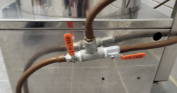

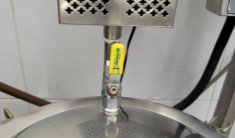

탕전 완료되면, 몸통 부분 / 뚜껑 부분

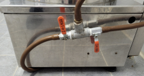

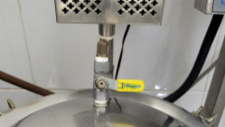

---

## 포장

포장기

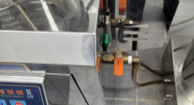

→ '압축' → 약이 탕전기에서 포장기로 넘어감 → 압력계에 0.1기압까지 상승되면 압축 멈춤 →
포장기에서 파우칭

뚜껑 부분

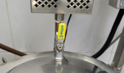

바람빼기 (놀랄 수 있으니 천천히). 몸통 부분

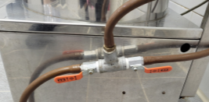

약탕기 청소.

---

## 포장기 청소

물 빠져나가게 밸브를 열고 청소합니다.

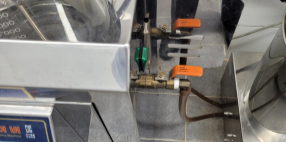

- 청소할 때마다 구석구석 닦기. 용기는 물론, 호스에 찌꺼기가 끼지 않도록.
- 물을 받아 처음 닦아서 내릴 시 '세척' 버튼도 같이.
- 마지막 탕전 끝나고 청소할 때는 구멍청소까지. (포장기 밑에 순서가 있습니다)

※ 솔을 넣어 청소할 때는 정해진 구멍으로 넣도록 합니다. 안에서 호스가 찢어질 수 있습니다.

---

## 한약 수령 (직접수령 또는 택배)

### 직접 수령일 경우

포장까지 완료 후 문자를 보냅니다.

① 치료실 프로그램에서 환자이름으로 검색 ② 'SMS메세지' 클릭 ③ '현재 환자에게 SMS 보내기' 클릭
④ '직접수령안내' 더블클릭 ⑤ 'LMS' 클릭 ⑥ '문자 전송하기' 클릭

※ 다이어트 환(이터널)으로 드시는 분들에게 전송할 경우 '정성들여 달인 한약'을 지우고
'다이어트 환'으로 내용 변경 후 '메시지 적용'을 누르고 'LMS'를 클릭합니다.
다른 내용도 변경하는 게 있으면 '메시지 적용'을 눌러야 바뀐 내용이 반영됩니다.

### 택배로 보낼 경우

오후 3시 전에 택배 기사님께 전화로 수거 요청합니다.

**택배 송장 인쇄**

바탕화면 'CNPLUS'

예약 → '기업고객건별접수' 클릭 → 받는 분 전화번호 입력 → 이름 입력 →
주소(돋보기) 누르고 입력 → F5 저장 → 아래 '출력'에 체크된 거 확인하고 OZ 출력
→ 표준 A4 운송장(3단) → 프린터 → 확인

※ 한 달에 한 번씩 비밀번호 바꾸라고 안내가 나옵니다. 바꾼 뒤 공유하는 곳은 확인 필요.
비밀번호 자체는 이 문서에 적지 않습니다.

---

## 한약이 한의원을 떠난 후 할 일

직접 수령 후 또는 택배 수거 요청 전화 후에 처리합니다.

접수실 프로그램 → 예약플래너 → 한약복용 내원콜관리 → 이름 적고 '검색'

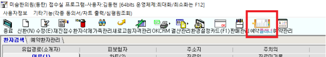

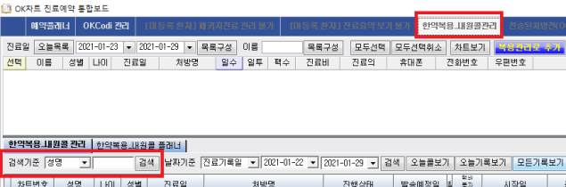

① '수령완료'로 바꾸기 ② '발송예정일'을 오늘 날짜로 변경
③ 택배 수거 시 '택배문자전송' 클릭 / 직접 수령 시 완료 옆 네모칸 직접 클릭
④ 'SMS예약전송' 클릭 ⑤ '수정' 클릭

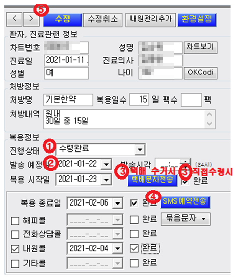

종이 차트에 빨간색으로 오늘 날짜를 적습니다.

---

## 택배 월말 정산

매달 첫째 근무일에 전달 택배 수량과 비용을 원장에게 전달합니다.

CNPLUS 프로그램에서 '고객실적' → '기업고객 정산현황' → '총 수량'과 '기본운임 합계' 확인
→ 원장실로 메시지

---

## 이터널 미니처방 내원콜관리

1. 진행상태는 '수령완료'로
2. 택배문자전송 옆에 완료에 체크 (택배문자전송을 누르는 게 아닙니다)
3. 내원콜 왼쪽 체크 없애기
4. 기타콜 체크
5. 현재일 + 3일로 선택. (예. 오늘이 11일이면 14일로 선택)
6. 'SMS 예약 전송' 누르기
7. 기타콜 날짜 옆에 완료에 체크 생겼는지 확인

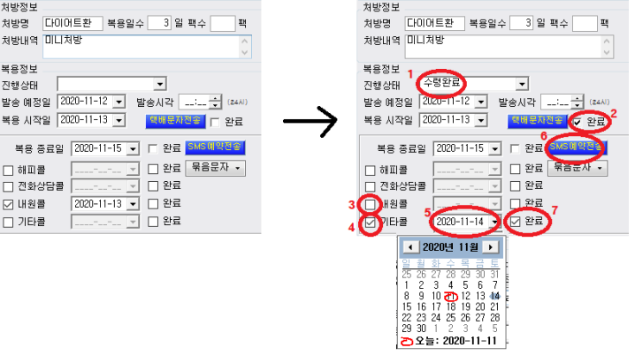

- 미니처방 받고 귀가하시는 분들께는 3일 뒤로 예약 잡기.
- 미니처방 복용 이후 정규과정으로 이어서 진행할 시, 전화 상담만으로도 처방 가능합니다.

**기타콜 문자 내용**

※ 원본 매뉴얼의 문구입니다. 우리 병원 이름과 전화번호로 바꿔서 등록해두고,
등록한 뒤 이 자리에 최종본을 적어주세요.

"[이름]님, 안녕하세요? 김포한강한의원입니다.
미니처방 복용은 괜찮으셨는지요? 불편 없으셨다면 이어서 정규 프로그램 진행하시는 것을 추천드립니다.
전화로도 연장 처방 가능하오니 편하게 연락주시기 바랍니다. 감사합니다.
회신번호 031-8049-7541"

---

## 복용법

복용법 파일에 이름과 며칠 치인지 입력하여 출력합니다. (종료 시 '저장안함')

- 일반한약 : 15일분, 하루 2번 복용 (식전·식후 관계없이 오전에 한 번, 저녁에 한 번)
- 다이어트 한약 : 20일분, 하루 2번 식전 복용
- 자보한약 : 10일분, 하루 2번 복용 (총 21일치까지 처방 가능)

Q. 자동차보험 한약 무슨 한약인가요?
A. 교통사고는 살짝 부딪쳐도 몸이 많이 놀라게 됩니다.
안정시켜주고, 어혈을 없애주고, 근육을 풀어주고, 붓기도 빼주는 한약이니까,
잘 회복하시도록 꼬박꼬박 챙겨 드시는 게 좋습니다.
식전 식후, 차갑게 뜨겁게 관계없습니다. 하루 2번 복약만 잘 해주세요.

---

## 첩약보험 (생리통)

※ 원본 매뉴얼에 목차만 있고 내용이 비어 있던 항목입니다.
대상 질환, 적용 조건, 접수·청구 절차, 본인부담금을 여기에 적어주세요.

---

## 한약 비용표

※ 금액은 이 표에서만 관리합니다. 바뀌면 여기를 고치고
[개정 이력](./README.md#개정-이력)에 한 줄 남깁니다.

성인 기준

| 기간 | 한약 | 녹용한약 |
| --- | --- | --- |
| 15일 | 25만원 | 35만원 |
| 한 달 (30일) | 45만원 | 63만원 |
| 두 달 (60일) 5% dc | 85만원 | 114만원 |
| 세 달 (90일) 10% dc | 120만원 | 162만원 |

소아

| 체중 | 적용 |
| --- | --- |
| 35 – 50 kg | 80% |
| 25 – 35 kg | 65% |
| 25 kg 이하 | 50% |

※ 원본에는 「80% 할인 / 65% 할인 / 50% 할인」으로 적혀 있습니다.
문자 그대로 읽으면 체중이 큰 쪽이 더 많이 깎이는 셈이라 앞뒤가 맞지 않아서,
성인 금액의 80%, 65%, 50%를 받는 것으로 읽었습니다. 어느 쪽이 맞는지 확인해서 확정해주세요.

녹용 등급 — 뉴질랜드 50, 러시아 전지 60, 러시아 분골 70

※ 원본에 단위가 없습니다. 가산 금액인지 다른 뜻인지 확인해서 채워주세요.

다이어트

| 종류 | 금액 |
| --- | --- |
| 환제 | 1달 14만원 / 3개월 39만원 |
| 탕약 | 20일 1제 24만원 / 80일(3+1) 72만원 |
| 탕약 | 1달 33만원 / 3개월 89만원 |
| 날씬주사 | 1회 4.9만원 / 10+2 49만원 |
| 패키지 | 탕약 3개월 + 날씬주사 12회 = 109만원 |

그 외 비급여는 [원무 · 정산 · 재고 매뉴얼](./admin.md#비급여-가격)을 봐주세요.
